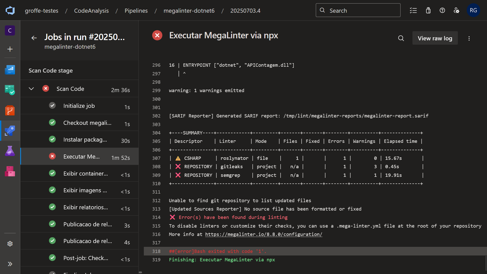

# azuredevops-megalinter-dotnet7
Exemplo de uso da ferramenta open source MegaLinter na análise de código e detecção de problemas de problemas de segurança a partir de um pipeline do Azure DevOps (com uma aplicação em .NET 7). 

Para saber mais sobre o MegaLinter acesse: https://megalinter.io/latest/

---

Ao executar no pipeline o commando:

```bash
npx mega-linter-runner --flavor dotnet \
    -e "'ENABLE_LINTERS=CSHARP_ROSLYNATOR,REPOSITORY_GITLEAKS,REPOSITORY_SEMGREP'" \
    -e 'SARIF_REPORTER=true' \
    -e 'SHOW_ELAPSED_TIME=true' \
    -e "'REPOSITORY_SEMGREP_RULESETS=p/dockerfile,p/owasp-top-ten'"
```

A imagem **oxsecurity/megalinter-dotnet** será baixada:


Com a execução na sequência do comando (não declarado no pipeline de exemplo, mas acionado a partir de **npx mega-linter-runner**):

```bash
docker run --platform linux/amd64 --rm -v /var/run/docker.sock:/var/run/docker.sock:rw -v /home/vsts/work/1/s/src:/tmp/lint:rw -e ENABLE_LINTERS=CSHARP_ROSLYNATOR,REPOSITORY_GITLEAKS,REPOSITORY_SEMGREP -e SARIF_REPORTER=true -e SHOW_ELAPSED_TIME=true -e REPOSITORY_SEMGREP_RULESETS=p/dockerfile,p/owasp-top-ten oxsecurity/megalinter-dotnet:v8
```


Produzindo como resultados:


